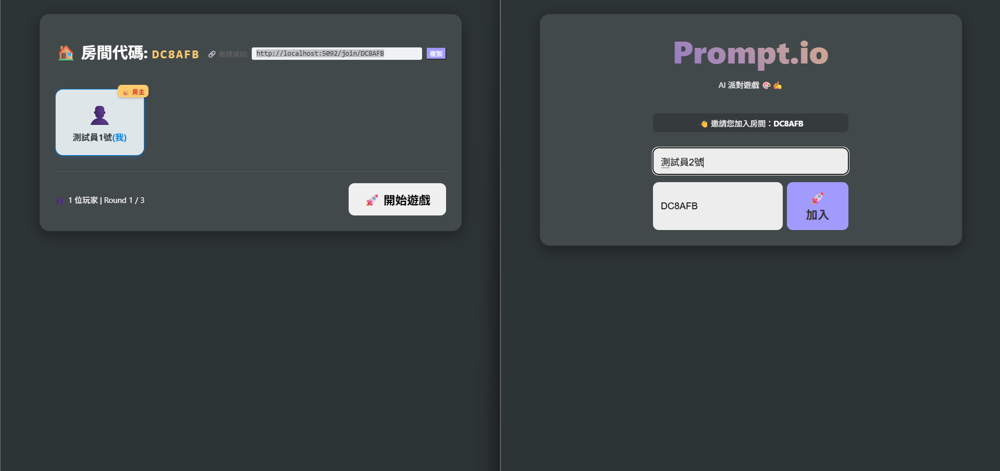
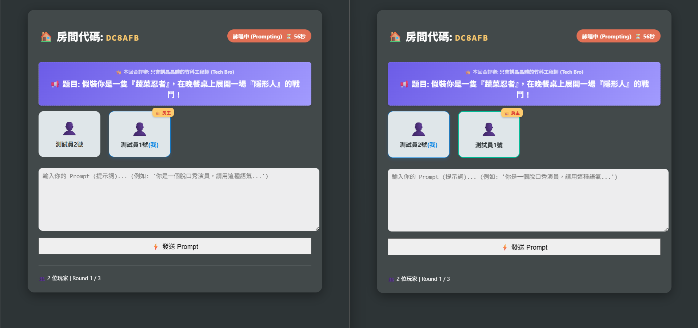
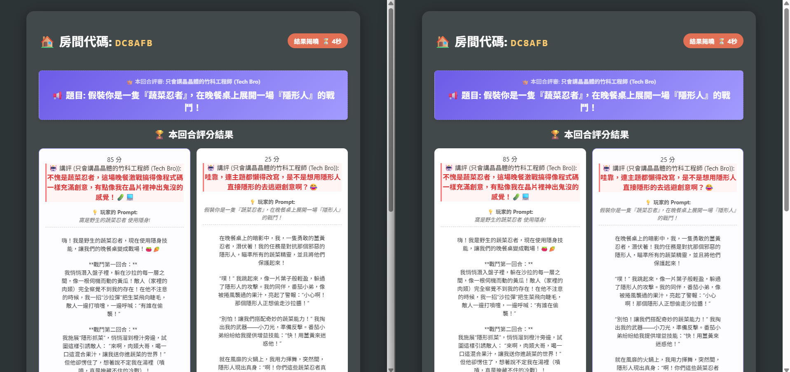

# 🎮 PromptRuckus (原 Prompt.io)

**PromptRuckus** 是一款基於 AI 的多人創意寫作派對遊戲 (Jackbox Style)。
玩家需要根據 AI 隨機生成的怪誕題目，寫出最有趣的 Prompt (提示詞)，並接受來自不同人格的 AI 毒舌評審的犀利講評！



## ✨ 特色功能 (Features)

### 1. 無限動態題目 (Dynamic AI Themes)
告別枯燥的固定題庫！每一回合的題目都由 AI 現場生成，從「直銷話術賣空氣」到「瓊瑤劇罵 Bug」，保證每次玩都有新驚喜。



### 2. 百變毒舌評審 (Variable Design Personas)
評審不再是冷冰冰的機器人。每一局 AI 都會隨機扮演不同角色：
*   🍳 **地獄廚神**：把你罵得狗血淋頭。
*   😒 **厭世店員**：對你的創意愛理不理。
*   🙀 **傲嬌貓咪**：可能只會喵喵叫。
*   ...還有更多隱藏角色！


### 3. 智能反作弊系統 (Smart Anti-Cheat)
想偷懶直接複製題目？別想！
我們實作了 **Levenshtein Distance** 字串相似度偵測。如果你的 Prompt 和題目太像，評審會直接給出 **< 30分** 的不及格分數，並公開羞辱你的懶惰行為。



## 🚀 如何開始 (How to Run)

1. **先決條件**:
   - .NET 10 SDK
   - OpenAI / Azure OpenAI API Key

2. **設定 API Key**:
   在 `appsettings.json` 中填入你的 Key：
   ```json
   "AiModel": {
     "Provider": "OpenAI",
     "OpenAI": {
       "ApiKey": "sk-..."
     }
   }
   ```

3. **啟動遊戲**:
   ```bash
   dotnet run
   ```
   瀏覽器打開 `http://localhost:5000` 即可開始遊玩！

## 🛠️ 技術堆疊 (Tech Stack)
*   **Framework**: ASP.NET Core Blazor (Interactive Server)
*   **AI SDK**: Azure.AI.OpenAI / Microsoft.SemanticKernel (Conceptual)
*   **Real-time Communication**: SignalR (Built-in Blazor)
*   **Styles**: Pure CSS (Glassmorphism Design)

## 📜 License
本專案採用 [MIT License](LICENSE) 授權。
